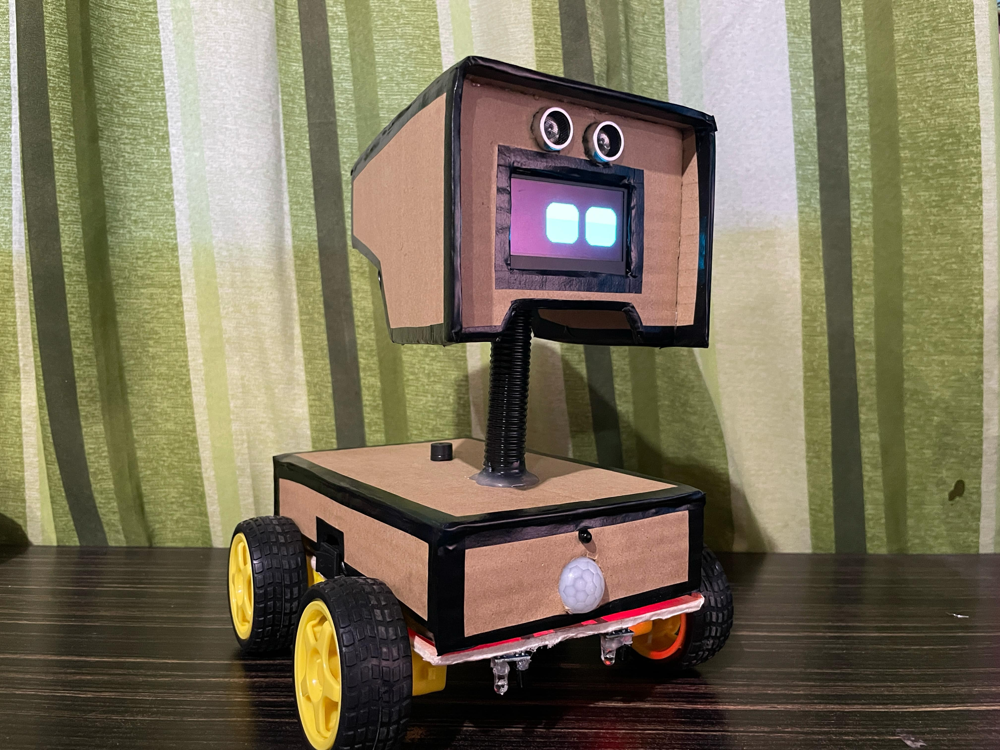
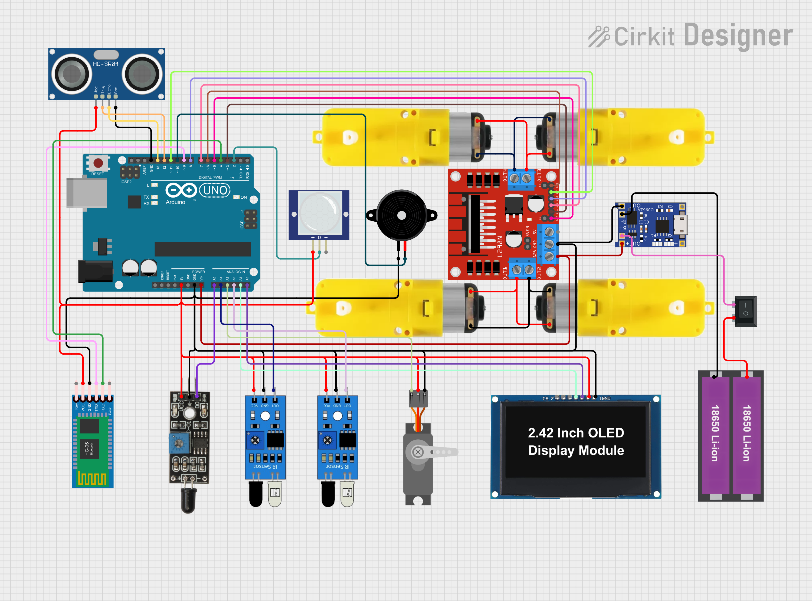
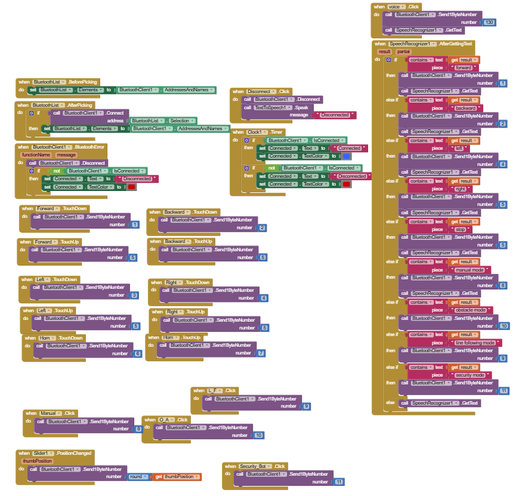

# COCO: An Arduino Smart Robot Project

Welcome to the repository for COCO, an Arduino-based smart robot project designed to function as an interactive pet robot. This project combines various sensors, modules, and a unique design to create a multifunctional, responsive robot with a charming personality.

## Project Overview

COCO is a smart Arduino car equipped with sensors and an OLED display to provide interactive responses based on environmental inputs. Designed with a focus on obstacle detection, line following, Bluetooth controlled, flame detection and motion detection, COCO is more than just a fun pet; it's a versatile project that demonstrates the integration of hardware and software.

## Key Features

- **Interactive OLED Display:** Displays various emotions and alerts based on COCO's activities and sensor inputs.

- **Object Detection:** Uses ultrasonic sensors to detect objects and avoid obstacles.

- **Line Following:** Uses Infrared Reflective Sensors to detect black lines.

- **Bluetooth Controlled:** Controlled via a Bluetooth module for remote interaction along with Voice Commands.

- **Flame Detection:** Uses Flame Sensor to detect fire nearby.

- **Motion Detection:** Uses Passive Infrared Sensor to detect motion.

## Components Used

- **Arduino Uno:** Core microcontroller for managing sensors and actuators.

- **OLED Display (I2C):** Used for showing eyes that change based on COCO's state.

- **IR Sensors:** Detect nearby objects to avoid collisions.

- **Ultrasonic Sensor:** Measures distance to objects for precise navigation.

- **Servo Motor:** Controls the head movement for added personality.

- **L239N Motor Driver:** Manages motor control for movement.

- **Bluetooth Module:** Enables remote control via a mobile app.

- **Buzzer/Speaker:** Provides audio feedback for alerts.

- **DC Geared Motor:** Motors used to move the robot.

- **TP4056 Charging Module:** Module for charging the batteries.

- **18650 Li-ion Batteries:** Power supply of the robot.

- **Rocker Switch:** Used for turning on and off the robot.

## How to Use COCO

- **Assemble the Car:** Follow the wiring diagram provided in the docs folder to connect all components properly.

- **Upload the Code:** Use the Arduino IDE to upload the provided sketch to the Arduino Uno.

- **Download App or Modify app:** Use the given application or further modify the app to your likings using the .aia file given.

- **Power On:** Turn on the switch

- **Interact:** Control COCO via Bluetooth and Smartphone using the dedicated app.

## Project Structure

**app/:** Contains the apk and aia file for android and MIT APP Inventor.

**code/:** Contains the Arduino sketch for COCO's functionalities.

**docs/:**  Includes assembly instructions, wiring diagrams, and component specifications.

**media/:** Photos and videos of COCO in action.

## Future Enhancements

Optimized Code: Improve the code for smoother operation.

## Contributing

We welcome contributions to enhance COCO. Please fork the repository and submit a pull request with your improvements or bug fixes.

## License

This project is licensed under the MIT License. Feel free to use, modify, and distribute it as long as proper attribution is given.

## Acknowledgments

Special thanks to the developers and contributors of the libraries and tools used in this project.

Enjoy exploring and enhancing COCO, your smart Arduino car!
